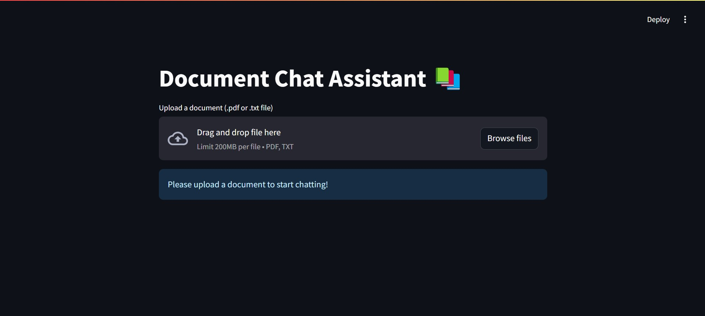
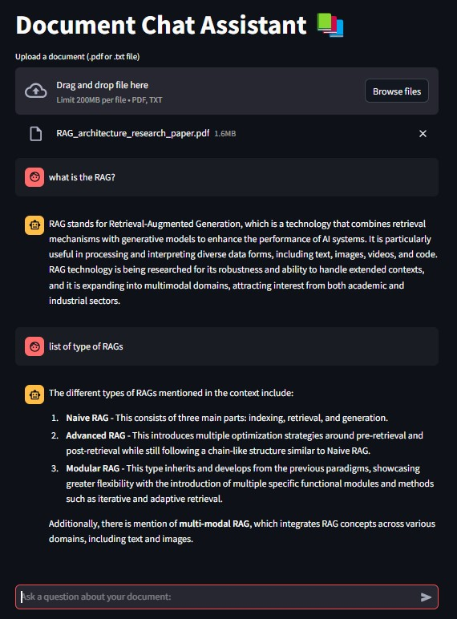

# Document Chat Assistant 📚

A Streamlit-based chatbot application that allows users to upload documents and ask questions about their content using RAG (Retrieval Augmented Generation) and OpenAI's language models.

## Features

- 📄 Support for PDF and TXT file formats
- 💬 Interactive chat interface
- 🔍 Intelligent document retrieval using vector similarity search
- 🤖 Powered by OpenAI's language models
- 💾 Session state management for persistent conversations
- ⚡ Real-time document processing and response generation

## Demo

### 1. Document Upload Interface


### 2. Chat Interface


## Setup

### Prerequisites

- Python 3.8 or higher
- OpenAI API key

### Installation

1. Clone the repository:

```bash
git clone https://github.com/Jammer8085/RAG-Question-Answering-System.git
```

2. Create and activate virtual environment

(Windows)

```bash
python -m venv venv
venv\Scripts\activate
```

(Linux)

```bash
python -m venv venv
source venv/bin/activate
```

(macos)
```bash
python3 -m venv venv
source venv/bin/activate
```

3. Install the required dependencies:

```bash
pip install -r requirements.txt
```

4. Provide the OpenAI API key with following variable in app.py:

```bash
OPENAI_API_KEY="<YOUR_OPENAI_API_KEY_HERE>"
```

### Running the Application:

1. Start the Streamlit server:

```bash
streamlit run app.py
```

2. Open your web browser and navigate to `http://localhost:8501` to interact with the chatbot.


## Usage

1. **Upload a Document**
   - Click the "Upload a document" button
   - Select a PDF or TXT file from your computer
   - Wait for the document to be processed

2. **Ask Questions**
   - Type your question in the chat input box
   - Press Enter or click the send button
   - View the AI's response based on the document content

3. **View Conversation History**
   - All previous messages are displayed in the chat interface
   - The conversation persists throughout your session